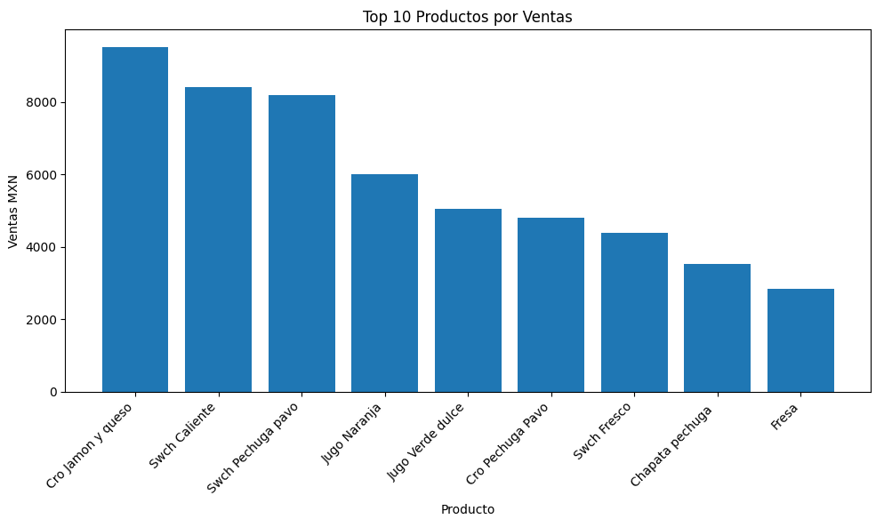
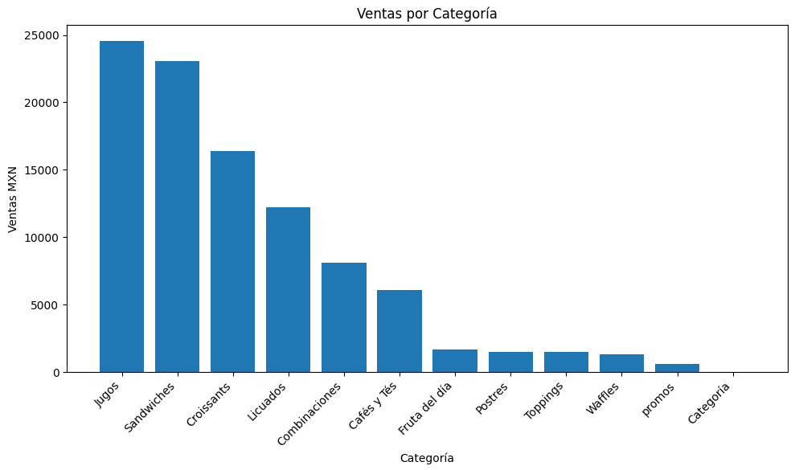
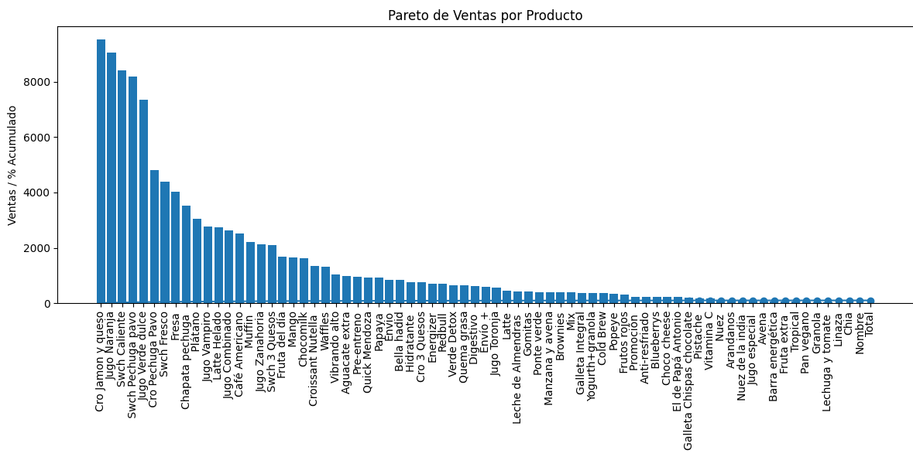

# 📊 Sales Analysis - Local Business

Real March 2026 sales data analysis from a food & beverage business.

## Tools
- Python
- Pandas
- Matplotlib
- Excel

## Results
- $106,615 MXN sales
- 1,983 units sold
- Top products identified
- Revenue by category analyzed

## 📊 Visualizations

